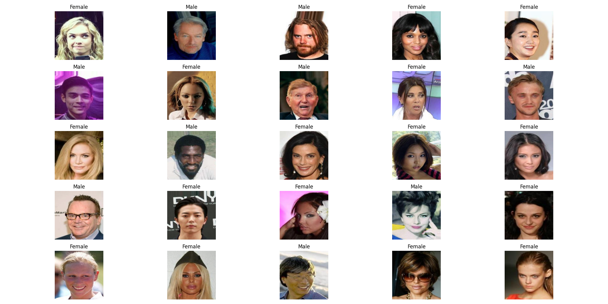

# Efficientnet for Gender Detection

## Overview

This Python project consits to use Efficientnet architecture to predict human gender using celebA database. The dataset is available <a href="https://www.kaggle.com/datasets/jessicali9530/celeba-dataset">here</a>.

  
  <h6 align="center">
    Some prediction examples
  </h6>  

## Requirements

- Python 3.10 or later
- Click
- Pytorch
